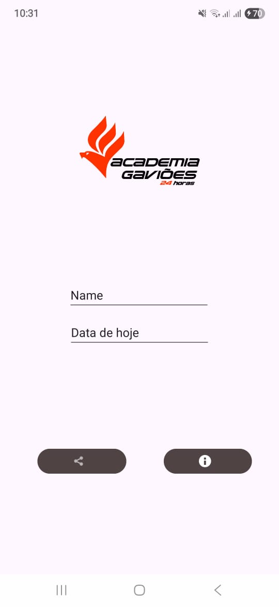
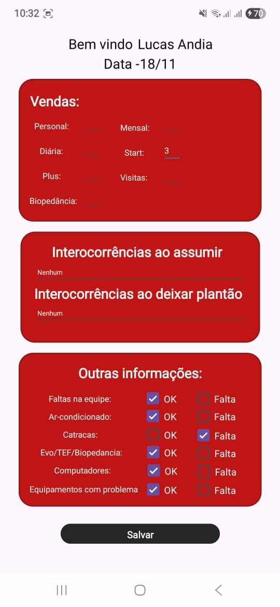

# 📱 Relatório Diário – Aplicativo Android

Este projeto é um aplicativo Android desenvolvido com o objetivo de facilitar o registro diário de informações referentes ao meu trabalho atual realizado na Academia Gaviões 24h. Ele permite que o usuário anote dados importantes, como vendas, intercorrências e condições gerais do ambiente, oferecendo uma forma simples e prática de salvar e compartilhar essas informações.

---

## ✨ Funcionalidades

### ✔️ Registro Diário Completo
O usuário pode preencher vários tipos de informações do dia, como:

- **Vendas:** Personal, Mensal, Diária, Start, Plus, Visitas e Biopedância.  
- **Intercorrências:**  
  - Ao assumir  
  - Ao deixar o plantão  
- **Outras informações gerais:**  
  - Faltas na equipe  
  - Ar-condicionado  
  - Catracas  
  - Evo/TEF/Biopedância  
  - Computadores  
  - Equipamentos com problema  

Cada item possui opções de seleção (*OK* ou *Falta*).

---

## 💾 Salvar Relatório

Ao clicar no botão **Salvar**, todas as informações preenchidas são armazenadas de forma organizada e segura dentro do aplicativo.

---

## 📤 Compartilhar Relatório

O aplicativo possui integração com o **WhatsApp**.  
Com um clique, o relatório preenchido é automaticamente formatado e enviado para o WhatsApp, permitindo ao usuário escolher a conversa para compartilhar.

---

## 🎨 Interface Amigável

A interface foi criada pensando em simplicidade e rapidez.  
Na tela inicial, o usuário informa apenas:

- Nome  
- Data do dia  

Depois disso, a tela de relatório é exibida para preenchimento.

---

## 🚧 Melhorias Futuras

O aplicativo já está finalizado em suas funcionalidades principais, mas continua em evolução. Entre as próximas melhorias previstas:

### 📅 Relatório Semanal (em desenvolvimento)
Será adicionada uma nova funcionalidade permitindo gerar um relatório com o resumo completo da semana, oferecendo ainda mais organização para o usuário.

---

## 🛠️ Tecnologias Utilizadas

- **Kotlin**
- **Android Studio**
- **Intents** (para compartilhamento com o WhatsApp)
- **Views e Layouts XML**
- **Componentes nativos do Android**
  - EditText  
  - CheckBox  
  - TextView  
  - Button  

---

## 📸 Imagens do Aplicativo

### Tela Inicial

### Tela de Relatório

---

## 📄 Sobre o Projeto

Este aplicativo foi desenvolvido com foco na praticidade do dia a dia. Ele facilita o preenchimento de relatórios, padroniza informações e agiliza o processo de comunicação com a equipe ou supervisores por meio da integração direta com o WhatsApp.

---

Se quiser, posso adicionar também:

- Badges (Android, Kotlin, Versão, Status)
- Instruções de instalação e execução
- GIFs de demonstração do app
- Sessão de changelog ou licença

Só pedir! 😊
